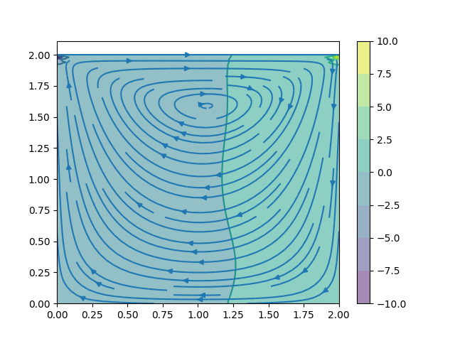

# Cavity Flow

Numerical solution of Navier-Stokes equation for 2D cavity flow. See [CFD Python: the 12 steps to Navier-Stokes equations](https://doi.org/10.21105/jose.00021) for details.


## Parallelisation

* Serial
* [OpenMP](https://www.openmp.org/)
* [CUDA](https://developer.nvidia.com/)

### Test Machine

```
Architecture:        x86_64
CPU op-mode(s):      32-bit, 64-bit
Byte Order:          Little Endian
CPU(s):              12
On-line CPU(s) list: 0-11
Thread(s) per core:  1
Core(s) per socket:  12
Socket(s):           1
NUMA node(s):        1
Vendor ID:           GenuineIntel
CPU family:          6
Model:               63
Model name:          Intel(R) Xeon(R) CPU E5-2650L v3 @ 1.80GHz
Stepping:            2
CPU MHz:             1199.354
CPU max MHz:         2500.0000
CPU min MHz:         1200.0000
BogoMIPS:            3598.03
Virtualisation:      VT-x
L1d cache:           32K
L1i cache:           32K
L2 cache:            256K
L3 cache:            30720K
NUMA node0 CPU(s):   0-11
```

### Timings

```
+++ Cavity Flow +++
Lx = 2          Ly = 2
Nx = 101        Ny = 101
dx = 0.02       dy = 0.02
dt = 0.0001
+++ ----------- +++

serial::run[1]          13600 ms
omp::run[8]             5733 ms
cu::run[(4,4),(32,32)]  997 ms
```

## Plotting

```
python plot.py p_serial.dat u_serial.dat v_serial.dat serial
python ../plot.py p_omp.dat u_omp.dat v_omp.dat omp
python ../plot.py p_cu.dat u_cu.dat v_cu.dat cu
```

## Singularity

## Build

```bash
sudo singularity build singularity.sif singularity.def
```

## Interactive Shell

```bash
singularity shell --nv singularity.sif
```
